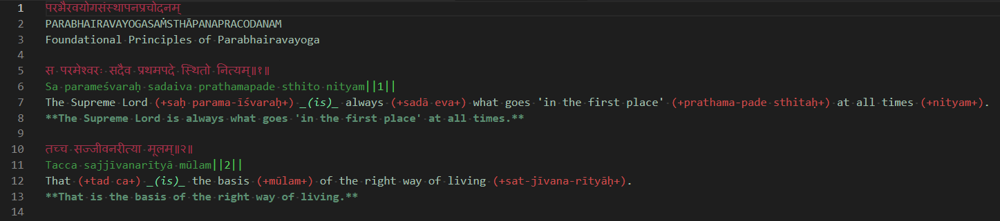

# pby-highlight-vscode

## Description

Pby format highlight for scriptures in markdown and html.

Pby is a shorthand for **Parabhairavayoga**, which is a new Yoga founded by **Gabriel Pradīpaka**.

This vscode extension provides syntax highlight for Yoga scriptures with the Pby format, inside markdown and html files.

Pby format is invented to display scriptures with colorization, without using html tags.

### Features

- Pby format highlight for scriptures in markdown and html
  - for Devanāgarī
  - for IAST: lines ends with `|` or `||` marks (currently without multiline support)
  - for bracketed words: `(word)`
  - for bracketed words with signs: `(+word+)`
  - for underscored bracketed words: `_(word)_`

With dark theme:

### Extension Settings

- For dark themes:
  - Use this [Workspace settings](workspace-settings/darktheme/settings.json "Workspace settings") in your workspace `settings.json` file.

- For light themes:
  - settings will be available in a next release

### Known Issues

IAST highlighting currently dont work with multilines

### Release Notes

### 1.0.0

First release

-----------------------------------------------------------------------------------------------------------

**Enjoy!**
